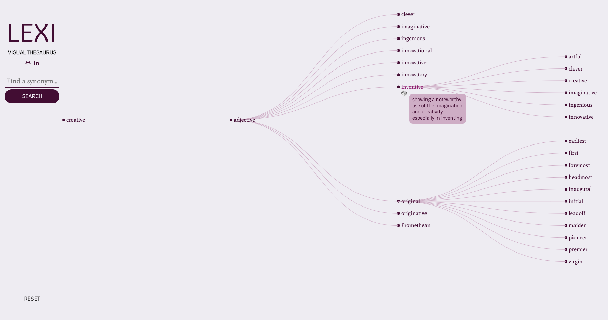

# Lexi: A Visual Thesaurus
### Background and Overview
We've all been there: you're writing something—an important email, a thoughtful note, a novel⁠—and you realize you've used the same word five times in two paragraphs. Cue the "words like ..." search. With crowded, ad-heavy interfaces and a user experience that remains largely unchanged since the early 2000s, online thesauruses leave much to be desired. 
    
**Lexi** offers users a seamless, intuitive user experience, tracing a clear visual and verbal path from one synonym to the next until you find that perfect word.

### Functionality and Features
* Users enter a root word for which they'd like a synonym, and Lexi displays a path via each lexical type (noun, verb, adjective, etc.) and a list of synonyms they can choose from to begin exploring.
* Hovering over a lexical type shows the specific definition of the root word for that type.
* Synonyms will always populate only within the scope of the seleted word type (i.e. selecting a noun will only populate other nouns).
* Once user a clicks on a synonym, that word's definition becomes visible on on hover, and its synonyms are populated as an expansion of the tree. 

### Architecture and Technologies
* **Vanilla Javascript** for all data manipulation
* **Webpack** for bundling scripts into a single source
* **Merriam-Webster API** as the core API endpoint for this project
* **D3** as the backbone of Lexi's visual depiction

### Implementation Timeline
* **Day 1:** Set up overall file structure, requested API key, implemented logic via vanilla JS DOM manipulation
* **Day 2:** Researched D3 and started bilding out data visualization using a static dataset.
* **Day 3:** Integrated API calls into D3 interactive display, storing and passing data via sessionStorage.

* **Planned Expansions:**
    * Integrate animation so that if a user clicks an already expanded node, the node will collapse, hiding any of its children.
    * The more times a word appears in the results tree, the darker/brighter its color, so you can see its relevance compared to the body of words examined so far.