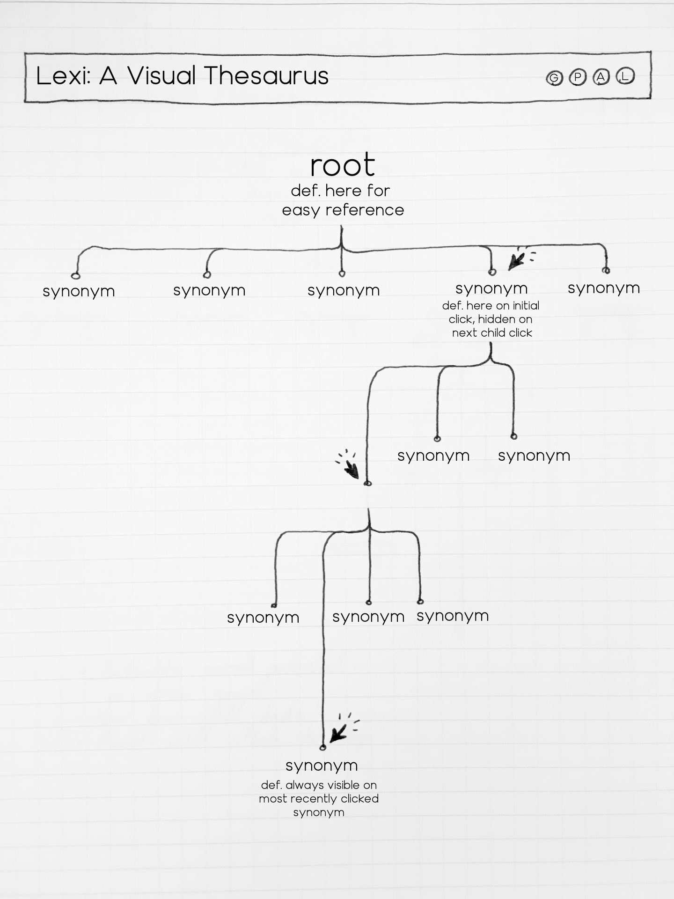

# Lexi: A Visual Thesaurus
### Background and Overview
We've all been there: you're writing something--an important email, a thoughtful note, a novel--and you realize you've used the same word five times in two paragraphs. Cue the "words like ..." search. With crowded, ad-heavy interfaces and a user experience that remains largely unchanged since the early 2000s, online thesauruses leave much to be desired. 
    
**Lexi** will offer users a seamless, intuitive user experience, tracing a clear visual and verbal path from one synonym to the next until you find that perfect word.

### Functionality and Features
* Users can enter a root word for which they'd like a synonym, and Lexi will display the word's definition as well as a series of synonyms they can choose from to begin exploring
* When a user clicks on a synonym, that word's definition is displayed, and its synonyms are populated in an expansion of the tree. 
* If a user clicks an already expanded node, the node will collapse, hiding the definition and any of its children.
* Regardless of how far down the tree you explore, The root word and its definition are always be displayed for easy comparison, as well as the definition of whatever node is currently selected. Other ancestor nodes will automatically collapse (only showing the word, no definition).
Future Expansions:
    * The more times a word appears in the results tree, the darker/brighter its color, so you can see its relevance compared to the body of words examined so far.
    * Ability to see and select antonyms 'growing' in the other direction

### Architecture and Technologies
* **Vanilla Javascript** for all data manipulation
* **Webpack** for bundling scripts into a single source
* **Merriam-Webster API**: the core API endpoint for this project, GET requests will be formatted to retreive definitions and synonyms for visualization.
* **D3**: the backbone of Lexi's relational depiction. I'll be building a collapsible tree framework, with the user's initial request as the root node, displayed alongside its definition. From there, the API will help generate a series of child nodes--words that when clicked, show their own definition (to compare with the parent node), and produce their own series of branching child nodes which can be shown or collapsed according to user actions.
### Implementation Timeline
* **Day 1 (Tues)**: Set up overall file structure, request API key, research D3 visualization
* **Day 2 (Wed)**: Build out backend for API handling, start building out D3 user interface. User will be able to display a root word with definition and its synonyms as children.
* **Day 3 (Thurs)**: Work on adding auto-collapsing of ancestor nodes and other visual styling